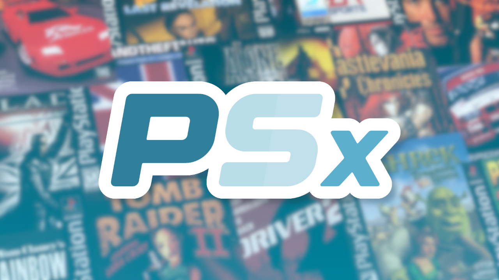

# 📀 PSXEmu

A work in progress PlayStation emulator for S&box featuring a modern UI, working BIOS and games.

> 🤖 This project has been made with the help of AI, this is my first project of this sort and I've no pretention of being good in this domain yet. So that mean probably a lot can be improved upon this project. (Bug fixes, more optimization and so on...) Feels free to propose your changes through pull requests if you find anything you wanna improve in this emulator.

## 🎮 Tested Games

(List really far from complete, I've only listed the couple of games I've tested personally)

### 🟢 Playable
- Crash Bandicoot (USA)
- Driver (USA)
- Driver 2 (USA/EU)
- Resident Evil (EU)
- Resident Evil 2 (USA/EU)
- Resident Evil 3 (EU)
- Dino Crisis (EU)
- Silent Hill (USA/EU/JAPAN) (With some broken rendering)
- Grand Theft Auto (USA)
- Alone In The Dark (USA)
- 007 Tomorrow Never Dies (USA)
- 007 The World Is Not Enough (USA/EU)
- (and many more not listed here)

### 🟡 In Game
- Gran Turismo (USA) (No audio + restart forever when starting a new game)
- Tomb Raider (EU) (No main menu music + freeze when starting a new game)
- and probably some others in this type of category

### 🟠 Intro
- N/A (So far never encountered any game that doesn't at least reach the main menu)

### 🔴 Not Working
- N/A (So far never encountered any game that doesn't boot at all)

> [!NOTE]
> Copyrighted ROMs and BIOS files are not included, you must provide your own.